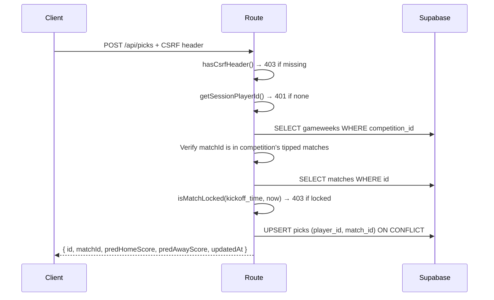

# Picks API Route

The single route at `POST /api/picks` handles both saving and re-editing a match prediction (upsert on `(player_id, match_id)`).

## Request

```json
{
  "matchId": "uuid",
  "homeScore": 2,
  "awayScore": 1
}
```

Score validation: both must be integers in range 0-9 (digit-row entry).

## Flow



## Security checks

1. **CSRF**: `x-tipperoos-client` header required
2. **Authentication**: valid session cookie
3. **Competition scope**: the `matchId` is verified against the player's competition's gameweeks (join through `gameweeks.competition_id`) — confirming the match is actually a tipped match in the player's competition
4. **Lock enforcement**: `isMatchLocked(kickoff_time, new Date())` — picks lock 5 minutes before kickoff. This uses application-server time (`new Date()`) rather than DB time (`get_db_time()` RPC). **Known implementation/spec divergence**: the CLAUDE.md spec says "all lock/deadline enforcement is server-side" but the table-prediction routes correctly use DB time via `getDatabaseTime()` RPC, while the picks route uses application-server time. The Vercel application server's clock is authoritative for now; a clock-sync issue could briefly drift the lock window.
5. **Score range**: both sides must be `0 ≤ n ≤ 9`, integers

## Upsert behavior

The upsert uses `onConflict: "player_id,match_id"`, so:

- First save: inserts a new pick row
- Re-edit: updates the existing pick row (including `updated_at` timestamp)
- Lock enforcement means re-edits are impossible after the 5-minute window

Returns the saved pick data in camelCase (matching every other route convention).

## Related

- [Pick Board Overview](../pick-board/overview.md)
- [Tipped Match Card](../pick-board/tipped-match-card.md)
- [Match Selection Rules](../match-selection/rules.md)
