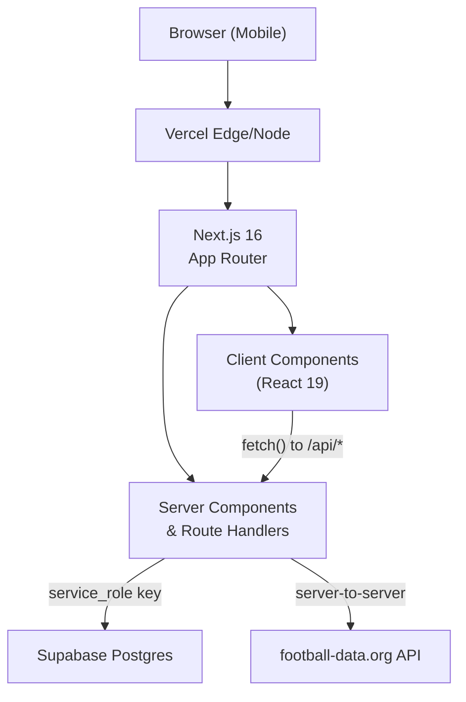

# Architecture Overview

Tipperoos is a private **Premier League tipping competition** — a Next.js application on Vercel backed by Supabase Postgres. It serves a small private group (~10–20 players across several households) with a season-long, two-matches-per-gameweek tipping format.

## System diagram

## Stack

| Layer         | Technology                                              | Rationale                                                             |
| ------------- | ------------------------------------------------------- | --------------------------------------------------------------------- |
| Framework     | **Next.js 16** (App Router)                             | Server Components for zero-bundle data access; Route Handlers for API |
| Hosting       | **Vercel** (Hobby tier)                                 | Free, auto-deploys from GitHub                                        |
| Database      | **Supabase Postgres** (free tier)                       | Managed Postgres, CLI migrations                                      |
| Styling       | **Tailwind CSS v4**                                     | Utility-first, `@theme` tokens in `globals.css`                       |
| UI Components | **tailwind-variants**                                   | Type-safe variant props                                               |
| Icons         | **lucide-react**                                        | Lightweight icon library                                              |
| Auth          | **Application-level** (HMAC-signed cookie + scrypt PIN) | Not Supabase Auth — all DB access is server-only                      |
| External data | **football-data.org** (free tier)                       | Premier League fixtures, standings, results                           |

## Three-environment mapping

Every environment uses **real Supabase projects** — there is no local Docker/Postgres stack.

| Environment | Next.js runs on           | Supabase project | Env vars source            |
| ----------- | ------------------------- | ---------------- | -------------------------- |
| Local dev   | `next dev` (your machine) | staging          | `.env.local` (gitignored)  |
| Preview     | Vercel (per-branch URL)   | staging          | Vercel Preview env vars    |
| Production  | Vercel (`main` deploy)    | production       | Vercel Production env vars |

**Discipline**: schema migrations must be applied to staging first, verified, then applied to production before merging the branch that depends on them.

## Security invariants

See [Security Model](security-model.md) for the full treatment. Key constraints:

1. **All DB access is server-only.** Client Components never call Supabase directly. The `createServerSupabaseClient()` holds the `service_role` key and is guarded by `import "server-only"`.
2. **Auth is not Supabase Auth.** No RLS, no `auth.uid()`. A stateless HMAC-signed cookie identifies the session player.
3. **CSRF protection** via a required custom header (`x-tipperoos-client`) on every state-changing route.
4. **Competition codes** are scrypt-hashed, never stored in plaintext or git history.

## Key architectural decisions

- **The Pick Board IS the home page** — no hub, no dashboard, no redirect (ADR-0007).
- **Gameweek resolution is derived per request** — no `is_current` column that a missed job could leave wrong.
- **Two auto-selected matches per gameweek** — nothing is player-chosen (ADR-0006).
- **All lock/deadline enforcement is server-side** — never trust a client clock.
- **Server Components for reads, Route Handlers for writes** — pages are `force-dynamic` and read data in the server component; mutations go through `POST` route handlers with CSRF checks.

## Core data model

The schema is managed via Supabase CLI migrations at `supabase/migrations/` (10 migrations as of writing). Key tables are documented in [Database Schema](../database/schema.md).

## Related

- [Security Model](security-model.md)
- [Bot Players](bot-players.md)
- [Result Lifecycle](result-lifecycle.md)
- [Database Schema](../database/schema.md)
