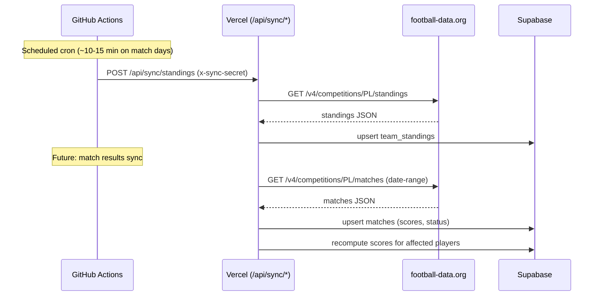

# Result Lifecycle

The end-to-end flow from a real-world match result to a player seeing their points on the Pick Board involves several stages — some implemented, some deferred.

## Current implementation: standings sync only

```
Manual trigger (POST to /api/sync/standings)
         │
         ▼
fetch football-data.org /v4/competitions/PL/standings
         │
         ▼
mapStandingsToRows() — extracts TOTAL group only
         │
         ▼
upsert team_standings (team_id, season_id, position, played)
         │
         ▼
insert sync_log row (status: success/failure)
```

The existing sync endpoint at `src/app/api/sync/standings/route.ts` is authenticated via a shared-secret header (`x-sync-secret`) — it does not use the player session cookie.

### What is synced

- **League standings** only (each team's position, games played, updated_at)
- Only the **TOTAL** group from the football-data.org response (the payload also carries HOME/AWAY splits which are ignored)

### What is NOT synced yet (deferred)

- Match results (`matches.team_a_score`, `matches.team_b_score`) are not written by the sync endpoint
- Match status updates (SCHEDULED → FINISHED) are not synced
- No scoring recompute engine exists — `src/lib/scoring/predict-table.ts` and `src/components/scoring/match-breakdown.ts` are pure functions not wired into any sync-triggered pipeline
- No scheduled GitHub Actions workflow triggers the sync — it must be invoked manually via POST

## Planned full lifecycle



Per BUILD_PLAN.md and ADR-0009, the scoring engine is:

> "Explicitly out of the launch window... needed within days of the first results, not before them."

## The sync_log table

Every sync attempt records a row in `sync_log`:

| Column          | Purpose                                                                 |
| --------------- | ----------------------------------------------------------------------- |
| `provider_name` | Always `"football-data.org"`                                            |
| `sync_type`     | `"standings"` (future: `"results"`, `"fixtures"`)                       |
| `status`        | `"success"` or `"failure"`                                              |
| `error_message` | Details on partial success (e.g., unmatched team IDs) or failure reason |

This table serves as the audit trail and will feed the planned pg_cron health-check watchdog.

## Related

- [Standings Sync](../standings-sync/overview.md)
- [Blank: Match Results Sync] — deferred
- [Blank: Scoring Recompute] — deferred
- [Seed Scripts](../standings-sync/overview.md)
