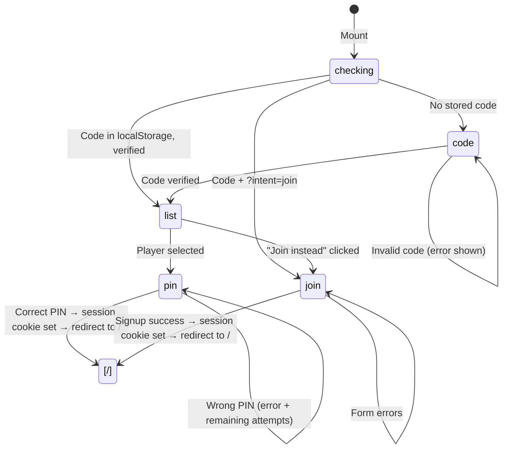

# Login Flow

The login page at `/src/app/login/page.tsx` implements a multi-step client-side flow (React 19, `"use client"`). Login and signup share the same entry path — picking a name logs in, "Join instead" signs up.

## Flow steps



### Step 1: Checking (mount)

On mount, the component reads `localStorage.getItem("tipperoos.competitionCode")`. If a previously-verified code exists, it silently re-verifies it via `fetchPlayers()`. If the code is stale (rejected by server), it's evicted from localStorage and the user falls back to the code entry step.

### Step 2: Code entry

The competition code is entered once per device. A returning device remembers a code that has already worked. The code gates everything — player list, signup, and login.

### Step 3: Player list / Join

After code verification, the user sees either:

- A list of existing players (select one to log in)
- A "Join instead" option (creates a new account)

The player list is fetched from `GET /api/auth/players` with the competition code in the `x-competition-code` header. Bots are excluded.

### Step 4: PIN entry or Join form

- **Login**: enter 4-digit PIN → `POST /api/auth/login`
- **Join**: pick display name, enter/confirm PIN, pick emoji → `POST /api/auth/signup`

Lockout messages show the local time when the account unlocks.

## Never-reject fetch contract

The `fetchPlayers()` function in `src/app/login/fetch-players.ts` uses a deliberate **never-reject** promise pattern:

```typescript
export type FetchPlayersResult =
  | { status: "ok"; players: Player[] }
  | { status: "invalid-code" }
  | { status: "error" };
```

**Why**: the mount-time silent-replay call site has no `.catch()`. If the promise rejects (network error, bad JSON), the user would be stuck on a permanent loading spinner. Instead, every scenario resolves to a discriminated union:

| Scenario                        | Returns                      |
| ------------------------------- | ---------------------------- |
| Successful fetch                | `{ status: "ok", players }`  |
| 403 response                    | `{ status: "invalid-code" }` |
| Network error / non-ok response | `{ status: "error" }`        |

This invariant is explicitly tested in `src/app/login/page.test.ts`.

## The STORED_CODE_KEY

The competition code (once verified) is stored in localStorage under `tipperoos.competitionCode`. This allows:

- Returning users on the same device to skip code entry
- Silent re-verification on mount (handles code rotation — stale codes are evicted)

## Login page test coverage

`src/app/login/page.test.ts` covers:

- The never-reject contract of fetchPlayers
- Code entry validation
- PIN entry flow
- Emoji selection and signup validation

## Related

- [Session Management](session.md)
- [PIN Security](pin-security.md)
- [Competition Codes](competition-codes.md)
- [Emoji System](emoji-system.md)
