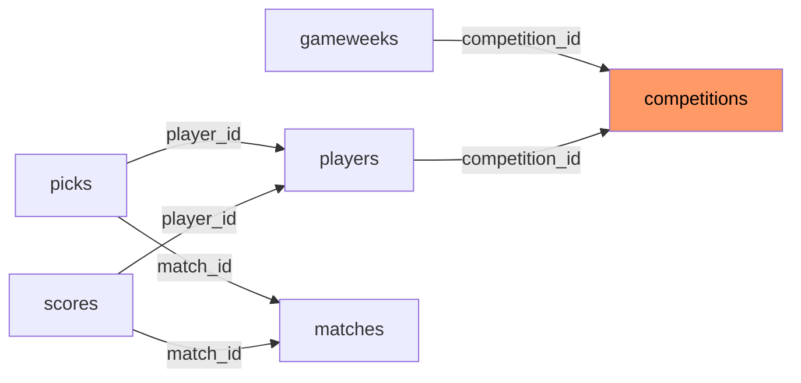

# Competition Scope Model

The multi-competition model (ADR-0004) enables multiple independent tipping groups, each scoped to the same real Premier League season but with their own players, picks, scores, and season winner.

## The scoping problem

`picks` and `scores` tables have no `competition_id` column — they are keyed by `(player_id, match_id)`. A query filtering only by `match_id` could leak one competition's picks into another's view if both competitions tip the same match.

**The rule**: always join back through `players.competition_id` — that's the one table in the chain that carries the competition boundary.

## Sanctioned query helpers (`src/lib/competitions/scope.ts`)

### `scoresForCompetition(supabase, competitionId, seasonId)`

Returns `CompetitionScoreRow[]` — one row per player in the competition, including players with no scores yet (points = 0).

```
SELECT players (scoped by competition_id)
LEFT JOIN scores (via matches.season_id filter)
→ foldCompetitionScores() → one row per player
```

The `seasonId` parameter is required because `scores` has no season column either — a competition-only filter would blend multiple seasons' points.

### `picksForMatch(supabase, matchId, competitionId)`

Returns picks for one match, scoped to one competition. **Enforces the lock itself** — if the match is not yet locked, returns `{ locked: false }` instead of picks.

```
Check isMatchLocked(kickoffTime, now)
If not locked → return { locked: false }

SELECT players (scoped by competition_id)
LEFT JOIN picks (by match_id)
→ foldCompetitionPicks() → one row per player
```

This is the only function that returns other players' picks — and it only does so **after** the match has locked. The lock enforcement is non-optional: forgetting it would breach pre-lock pick secrecy.

### `isMatchLocked(kickoffTime: Date, now: Date): boolean`

```typescript
const LOCK_WINDOW_MS = 5 * 60 * 1000; // 5 minutes

export function isMatchLocked(kickoffTime: Date, now: Date): boolean {
  return now.getTime() >= kickoffTime.getTime() - LOCK_WINDOW_MS;
}
```

### `foldCompetitionScores()`

Pure function: left-joins a competition's player roster onto score rows. Players with no score rows appear at 0 — required so Late Joiners and brand-new players still appear on the leaderboard.

### `foldCompetitionPicks()`

Pure function: left-joins a competition's full player roster onto their picks for a match. Non-pickers appear with null pick fields rather than vanishing from the reveal.

## The join-back pattern



Any query on `picks` or `scores` must go through `players` to establish the competition boundary.

## Scope isolation verification

The script `scripts/verify-competition-scope-isolation.mjs` proves this works by:

1. Seeding two competitions that tip the **same** match
2. Reading `scoresForCompetition` for each competition
3. Asserting each competition's read only ever sees its own players' rows (using `assert(rows.length === 1 && rows[0].playerId === <expected>)` — proves the specific count and player identity per competition)
4. Cleaning up all inserted rows in a `finally` block

**Why `matches`, `teams`, and `seasons` lack `competition_id`**: these tables carry global football facts shared across all competitions. A match result is the same regardless of which competition's player views it. Only `gameweeks` (the carrier of which fixtures are tipped for which competition) and `players` (the carrier of who is in which competition) need the column. `gameweeks` gained `competition_id` in migration `20260807010000_gameweeks_competition_scoped_unique.sql`.

The test file `src/app/_lib/pick-board-access.test.ts` verifies the security property directly by **spying on the `eq` and `in` calls** on the Supabase query builder — proving every `picks` and `scores` query uses `.eq("player_id", SESSION_PLAYER)` and `.in("match_id", MATCH_IDS)`, not just a bare `match_id` filter.

Runs against staging (no local Postgres stack). Not a CI gate.

## Related

- [Competition Bootstrap](bootstrap.md)
- [Security Model](../architecture/security-model.md)
- [Verification Scripts](../testing/verification-scripts.md)
