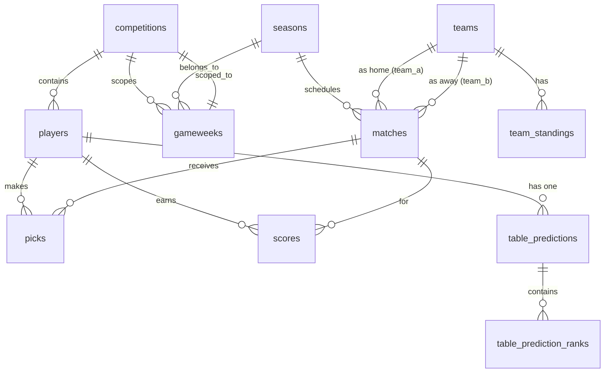

# Database Schema

The schema is managed as Supabase CLI migrations under `supabase/migrations/`. All migrations are numbered by a fictional date scheme (20260801...) since the real year is used for semantic ordering.

## Entity-Relationship Overview

## Core tables

### `competitions`

| Column       | Type        | Notes                           |
| ------------ | ----------- | ------------------------------- |
| `id`         | UUID        | PK                              |
| `name`       | text        | Display name                    |
| `code_hash`  | text        | scrypt hash of competition code |
| `created_at` | timestamptz |                                 |

A competition is a private group of players tipping independently on the same Premier League season. Two competitions share match data but never players/picks/scores. Exactly one exists today.

### `players`

| Column                | Type        | Notes                                 |
| --------------------- | ----------- | ------------------------------------- |
| `id`                  | UUID        | PK                                    |
| `competition_id`      | UUID        | FK → competitions                     |
| `display_name`        | text        | Unique (case-insensitive), 2-20 chars |
| `pin_hash`            | text        | scrypt hash `salt:key`                |
| `emoji`               | text        | Curated emoji                         |
| `email`               | text        | Optional, not unique                  |
| `is_admin`            | boolean     | Competition Admin                     |
| `is_bot`              | boolean     | Bot player flag                       |
| `bot_type`            | text        | `random`, `one_one`, or `median`      |
| `failed_pin_attempts` | int         | Lockout counter                       |
| `locked_until`        | timestamptz | Lockout expiry                        |
| `pin_reset_required`  | boolean     | Forced-reset flag                     |

### `seasons`

| Column       | Type    | Notes                      |
| ------------ | ------- | -------------------------- |
| `id`         | UUID    | PK                         |
| `label`      | text    | e.g. "2026-27"             |
| `start_date` | date    |                            |
| `end_date`   | date    |                            |
| `is_current` | boolean | Exactly one current season |

### `teams`

| Column             | Type | Notes                    |
| ------------------ | ---- | ------------------------ |
| `id`               | UUID | PK                       |
| `name`             | text | Short name               |
| `display_name`     | text | Full display name        |
| `short_code`       | text | e.g. "ARS"               |
| `crest_url`        | text | Team crest URL           |
| `provider_name`    | text | e.g. "football-data.org" |
| `provider_team_id` | text | External API ID          |

### `matches`

| Column              | Type        | Notes                                 |
| ------------------- | ----------- | ------------------------------------- |
| `id`                | UUID        | PK                                    |
| `season_id`         | UUID        | FK → seasons                          |
| `provider_name`     | text        | Source API                            |
| `provider_match_id` | text        | External match ID                     |
| `team_a_id`         | UUID        | FK → teams (home)                     |
| `team_b_id`         | UUID        | FK → teams (away)                     |
| `kickoff_time`      | timestamptz | UTC                                   |
| `status`            | text        | `scheduled`, `completed`, `postponed` |
| `team_a_score`      | int         | Actual result: home                   |
| `team_b_score`      | int         | Actual result: away                   |

### `gameweeks`

| Column              | Type        | Notes                                  |
| ------------------- | ----------- | -------------------------------------- |
| `id`                | UUID        | PK                                     |
| `season_id`         | UUID        | FK → seasons                           |
| `competition_id`    | UUID        | FK → competitions                      |
| `number`            | int         | Gameweek number (1-38)                 |
| `match_1_id`        | UUID        | FK → matches (nullable — Skipped Slot) |
| `match_2_id`        | UUID        | FK → matches (nullable — Skipped Slot) |
| `match_1_voided_at` | timestamptz | Set when Match 1 voided post-lock      |
| `match_2_voided_at` | timestamptz | Set when Match 2 voided post-lock      |

Unique constraint: `(season_id, competition_id, number)`.

### `picks`

| Column            | Type        | Notes                     |
| ----------------- | ----------- | ------------------------- |
| `id`              | UUID        | PK                        |
| `player_id`       | UUID        | FK → players              |
| `match_id`        | UUID        | FK → matches              |
| `pred_home_score` | int         | Player's prediction: home |
| `pred_away_score` | int         | Player's prediction: away |
| `updated_at`      | timestamptz |                           |

Unique constraint: `(player_id, match_id)`.

### `scores`

| Column       | Type        | Notes         |
| ------------ | ----------- | ------------- |
| `id`         | UUID        | PK            |
| `player_id`  | UUID        | FK → players  |
| `match_id`   | UUID        | FK → matches  |
| `points`     | int         | Points earned |
| `created_at` | timestamptz |               |

### `team_standings`

| Column       | Type        | Notes           |
| ------------ | ----------- | --------------- |
| `team_id`    | UUID        | FK → teams      |
| `season_id`  | UUID        | FK → seasons    |
| `position`   | int         | League position |
| `played`     | int         | Games played    |
| `updated_at` | timestamptz | Sync timestamp  |

Unique constraint: `(team_id, season_id)`.

### `table_predictions`

| Column         | Type        | Notes                  |
| -------------- | ----------- | ---------------------- |
| `id`           | UUID        | PK                     |
| `player_id`    | UUID        | FK → players (unique)  |
| `submitted_at` | timestamptz | Confirmation timestamp |
| `is_skipped`   | boolean     | Late Joiner skip flag  |

### `table_prediction_ranks`

| Column                | Type | Notes                                            |
| --------------------- | ---- | ------------------------------------------------ |
| `id`                  | UUID | PK                                               |
| `table_prediction_id` | UUID | FK → table_predictions                           |
| `team_id`             | UUID | FK → teams                                       |
| `band`                | text | Band key (`champion`, etc.)                      |
| `predicted_rank`      | int  | 1-20, stable after assignment (never renumbered) |

Two unique constraints protect data integrity:

- `table_prediction_ranks(table_prediction_id, team_id)` — prevents the same team appearing twice in one prediction
- `table_prediction_ranks(table_prediction_id, predicted_rank)` — prevents two teams sharing the same rank slot

The `predicted_rank` constraint is what fires error code `23505` when a concurrent-assignment race causes two teams to compute the same rank. The assign route's retry loop catches this and recomputes a fresh rank.

### `sync_log`

| Column          | Type        | Notes                    |
| --------------- | ----------- | ------------------------ |
| `id`            | UUID        | PK                       |
| `provider_name` | text        | e.g. "football-data.org" |
| `sync_type`     | text        | e.g. "standings"         |
| `status`        | text        | `success` or `failure`   |
| `error_message` | text        | Present only on failure  |
| `created_at`    | timestamptz |                          |

## Related

- [Migrations](migrations.md)
- [Pick Board Data Access](../pick-board/overview.md)
- [Competition Scope Model](../competitions/scope-model.md)
