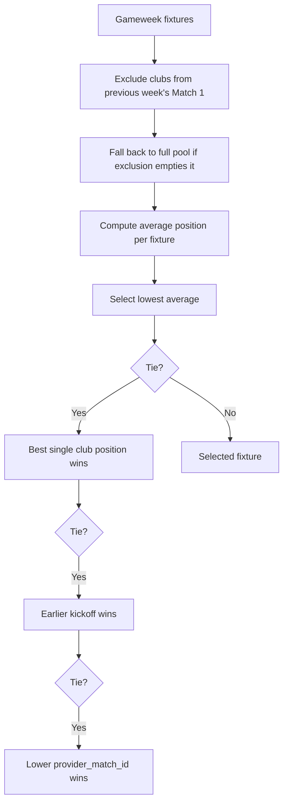
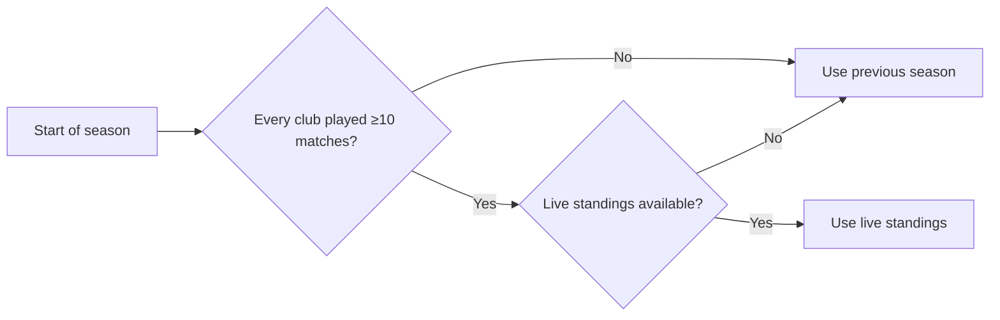

# Match Selection Rules

Each gameweek, exactly two Premier League fixtures are auto-selected for tipping — nothing is player-chosen. The selection logic (ADR-0006) is implemented as pure functions in `src/lib/match-selection/rules.ts`.

## Match 1 — Top Matchup

`selectTopMatchup(params)` chooses the fixture with the **lowest average league position** across its two clubs.



### Selection parameters

```typescript
interface SelectTopMatchupParams {
  fixtures: readonly SelectionFixture[];
  positions: readonly ClubPosition[];
  previousMatch1TeamIds: readonly string[]; // excluded for 1-week cooldown
}
```

### Position resolution

- Promoted clubs (no previous-season position) count as position **21** — below every returning club
- `PROMOTED_CLUB_SENTINEL_POSITION = 21`

### Exclusions

Clubs that appeared in the previous gameweek's Match 1 are excluded (so no club is the marquee two gameweeks running). If this would empty the fixture pool (degenerate case: a gameweek with only 1–2 fixtures), the exclusion is skipped.

## Match 2 — Random Pick

`selectMatch2(params)` draws a fixture uniformly at random from the gameweek's remaining fixtures, excluding Match 1 and anything already kicked off.

```typescript
interface SelectMatch2Params {
  fixtures: readonly SelectionFixture[];
  match1FixtureId: string | null;
  now: Date;
  random?: () => number; // injectable for deterministic tests
}
```

Returns `null` when the pool is empty — see [Skipped Slots](voided-matches.md).

## Rank source phasing

`chooseRankSource(params)` determines whether the Match 1 selection uses **previous season** positions or **live standings**:



- The check is **per-club minimum**, not average — a single postponement can't shift the switchover early
- Falls back to previous season if live standings are stale or unavailable

## Test coverage

`src/lib/match-selection/rules.test.ts` (13,300 bytes) covers:

- Correct selection of top matchup by position
- Tiebreaking logic (position, kickoff, provider ID)
- Match 2 random draw with deterministic seed
- Empty pool handling (returns null)
- Previous-week exclusion
- Rank source phasing edge cases

## Related

- [Voided Matches](voided-matches.md)
- [Gameweek Resolution](../gameweeks/resolution.md)
- [ADR-0006: Auto-selected Tipped Matches](../../docs/adr/0006-auto-selected-tipped-matches.md)
