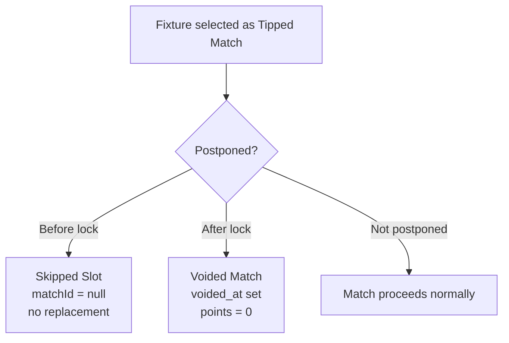

# Voided Matches and Skipped Slots

Postponements can happen before or after picks lock, producing two distinct outcomes with different player-facing meaning:

| Scenario         | When                  | Effect                                                                   | Replacement?  |
| ---------------- | --------------------- | ------------------------------------------------------------------------ | ------------- |
| **Skipped Slot** | Postponed before lock | Slot is empty (`matchId = null`), that gameweek runs with 1 tipped match | No (ADR-0001) |
| **Voided Match** | Postponed after lock  | Match stays referenced, `voided_at` is set, points are zeroed            | No            |

## Skipped Slot (pre-lock)

When a fixture is postponed before tips lock:

- **No auto-reselection** — the gameweek simply has one tipped match instead of two
- This avoids a second wave of "new match just appeared, pick fast" pressure on players
- The `gameweeks` row keeps `match_1_id` or `match_2_id` as `null`
- The `GameweekSlot` type in `resolve.ts` represents this with `{ matchId: null, kickoffTime: null, voidedAt: null }`

## Voided Match (post-lock)

When a fixture is postponed after picks locked:

- The match **stays referenced** in the gameweek — distinct from Skipped Slot
- `match_1_voided_at` or `match_2_voided_at` is set on the `gameweeks` row
- Points are zeroed for all players (the scoring recompute is the single authority)
- No reroll, no substitute match — this was the single point of unprompted, independent agreement across every analysis of this rebuild

## Lifecycle diagram



## Pick Board representation

The `PickBoardSlot` type in `src/app/_lib/pick-board-access.ts` distinguishes both cases:

```typescript
type PickBoardSlot =
  | { kind: "skipped" } // Skipped Slot — no match
  | {
      kind: "match";
      voided: boolean; // true = Voided Match
      // ... match info, own pick, points
    };
```

Presentation for both is deliberately undrawn by ADR-0007 — the current Pick Board renders nothing in a Skipped Slot's place.

## Gameweek resolver integration

The current-gameweek resolver (`src/lib/gameweeks/resolve.ts`) handles both:

- `slotHasTippedMatch()` returns `false` when `matchId === null` (Skipped Slot)
- `slotIsOpen()` returns `false` when `voidedAt !== null` (Voided Match — always locked by definition)

## Related

- [Match Selection Rules](rules.md)
- [Gameweek Resolution](../gameweeks/resolution.md)
- [Pick Board Overview](../pick-board/overview.md)
- [ADR-0001: Skip Slot on Pre-lock Postponement](../../docs/adr/0001-skip-slot-on-pre-lock-postponement.md)
