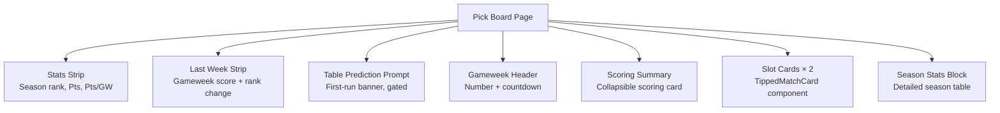

# Pick Board Overview

The app's landing route `/` **is** the Pick Board — there is no hub or dashboard in front of it (ADR-0007). It is a `force-dynamic` server component at `src/app/page.tsx`.

## Page layout

### Stats Strip

Shows the player's current season rank, total points, and points-per-gameweek-played. Before any gameweek is scored, rank and points are hidden (day-one variant).

### Last Week Strip

Summarizes the player's previous gameweek's score and rank change. Null before the first scored gameweek.

### Table Prediction Prompt

Rendered when:

- No table prediction has been submitted (`submittedAt == null`)
- The player hasn't skipped
- Gameweek 1 hasn't kicked off yet

This implements ADR-0007's first-run decision: prompt until submitted/skipped or Gameweek 1 kicks off. The `TablePredictionPrompt` component links directly to `/predict-table`.

### Tipped Match Slots

Two `PickBoardSlotCard` components, Match 1 above Match 2. Each renders a `TippedMatchCard` (or a skipped placeholder). Lock enforcement uses the same `isMatchLocked()` predicate as elsewhere.

### Season Stats Block

A detailed table of all gameweeks with points per week. Hidden before any scores exist (day-one variant).

## Data loading

The server component calls `loadPickBoardGameweek()` (`src/app/_lib/pick-board-access.ts`) which:

1. Resolves the current season
2. Loads the gameweek's two match slots
3. Fetches team data (name, short code, current league position)
4. Loads the player's own picks and points for those matches
5. Determines each slot's state (entry/filed/locked/live/finished)

The function **never returns another player's picks** — every query is scoped by both `player_id = session player` and `match_id IN (gameweek's tipped matches)`.

## Security property

> "No route on this page returns another player's pick" — issue #90 done-when.

All `picks`/`scores` queries in `pick-board-access.ts` are scoped by BOTH `player_id = <session player>` AND `match_id IN (this gameweek's tipped matches)`, per the match_id-alone-is-not-competition-scope rule.

### Test verification

The test file `src/app/_lib/pick-board-access.test.ts` directly verifies this security property by **spying on the `.eq()` and `.in()` calls** on mocked Supabase query builder instances. Each test that loads picks or scores asserts that:

- `.eq("player_id", SESSION_PLAYER)` is called (proving the query is scoped to the session player)
- `.in("match_id", MATCH_IDS)` is called (proving the query is scoped to the gameweek's tipped matches)

This catches regressions where a new query might accidentally omit either filter.

### Voided match detection

The loader applies **defensive voided-match detection**: if a match has `status === "postponed"`, it is treated as voided even when the `match_1_voided_at` / `match_2_voided_at` columns haven't been set yet. This ensures the Pick Board correctly handles postponements that arrive via sync before the `voided_at` column is written.

### Competition scope for season stats

`loadSeasonStats()` avoids leaking other competitions' data by calling `scoresForCompetition()` (from `src/lib/competitions/scope.ts`) with the session's `competitionId` — the same join-back-through-players pattern documented in [Competition Scope Model](../competitions/scope-model.md).

## Related

- [Tipped Match Card](tipped-match-card.md)
- [Match Selection](../match-selection/rules.md)
- [Gameweek Resolution](../gameweeks/resolution.md)
- [ADR-0007: Home Surface and Pick Entry](../../docs/adr/0007-home-surface-and-pick-entry.md)
