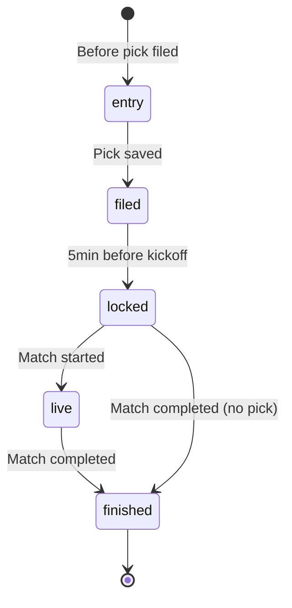

# Tipped Match Card

The `TippedMatchCard` component at `src/components/pick-board/TippedMatchCard.tsx` renders a single tipped match slot in all its states. It is the core interaction surface of the Pick Board.

## Card states

The component defines five mutually-exclusive states via the `TippedMatchCardState` discriminated union:



| State      | Description                              | Shown when                                                 |
| ---------- | ---------------------------------------- | ---------------------------------------------------------- |
| `entry`    | Empty score entry fields                 | Before the player files a pick; picks are never pre-filled |
| `filed`    | Pick saved, match not yet locked         | After successful save, before 5-min lock window            |
| `locked`   | Match locked, may or may not have a pick | After lock, before kickoff (or never started)              |
| `live`     | Match in progress, scores streaming      | Between kickoff and full-time                              |
| `finished` | Match completed, points shown            | After full-time, scores and points displayed               |

## Card anatomy

The component uses the `CardShell` / `CardShellHeader` / `CardShellSeam` / `CardShellBody` layout from `src/components/ui/CardShell.tsx`:

```
┌──────────────────────────────────────┐
│ Ink header: provenance + team info   │  ← CardShellHeader
├──────────────────────────────────────┤
│ Kit-colour seam (two-tone bar)        │  ← CardShellSeam
├──────────────────────────────────────┤
│ White body: picks / scores / status   │  ← CardShellBody
└──────────────────────────────────────┘
```

### Ink header

- Provenance label ("Top Matchup" or "Random Pick")
- Club-position badge (league position, rendered only when data exists)
- Club-code badge (kit-colour filled)
- Full team name
- Status chip (e.g. "Live", "Finished")

### Seam

Two-tone bar using the home and away clubs' kit colours. The `matchBadgeColors()` function in `src/lib/teams/kit-colors.ts` applies the contrast floor and clash rule.

### Body

Varies by state: entry fields, filed scoreline, locked/voided status, live scores, or finished result with points.

## Core interaction: onSave

The `onSave` callback is **awaited, not optimistic** (issue #15 decision 2):

- The card disables input and shows a "Filing..." stamp while the promise is pending
- On success, the card transitions to `filed`
- On rejection, the card returns to the empty entry state with an inline error
- Never shows "Filed" before the write is actually confirmed by the server

```typescript
interface TippedMatchCardProps {
  onSave: (homeScore: number, awayScore: number) => Promise<void>;
}
```

## Dev harness

A development-only harness at `src/app/dev/tipped-match-card/page.tsx` exercises every state with mock data. It's not linked from navigation — safe to delete once superseded by real Pick Board integration.

## Test coverage

Core match state rendering is tested through `PickBoardSlotCard` and the Pick Board access layer tests in `pick-board-access.test.ts`.

## Related

- [Pick Board Overview](overview.md)
- [Kit Colors](../design-system/kit-colors.md)
- [CardShell Components](../design-system/components.md)
- [Picks API Route](../api-routes/picks.md)
