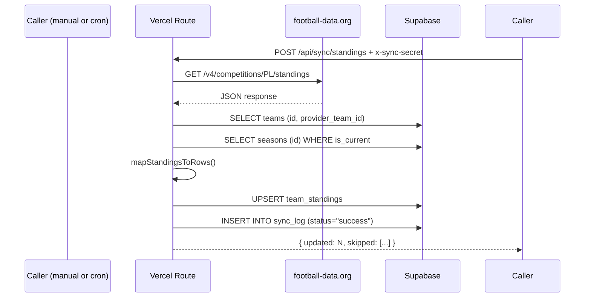

# Standings Sync

The standings sync pipeline fetches live Premier League standings from the [football-data.org](https://www.football-data.org/) API and upserts them into the `team_standings` table. This powers the league-position display on the Pick Board.

## Current state

**Match-result sync and scoring recompute are both deferred** (BUILD_PLAN.md — "Explicitly out of the launch window; needed within days of the first results, not before them"). Currently only `team_standings` (league positions and games played) is synced, not match results or scores.

## Sync endpoint

`POST /api/sync/standings` (`src/app/api/sync/standings/route.ts`)

### Auth

- Uses `x-sync-secret` header matching `SYNC_TRIGGER_SECRET` env var
- Not session-based (this is server-to-server, not player-to-server)
- No CSRF header needed (the shared-secret header is the auth mechanism)

### Flow

### Details

The `mapStandingsToRows()` function in `src/lib/standings/map-standings.ts`:

1. Finds the `TOTAL` group in the API response (also carries `HOME`/`AWAY` — ignored)
2. Maps each team via `provider_team_id` to internal team IDs
3. Unmatched provider team IDs are collected but skipped (not thrown — a new promoted club may not have been seeded yet)
4. Returns `{ rows: TeamStandingRow[], unmatchedProviderTeamIds }`

## On failure

Failed syncs log to `sync_log` with `status: "failure"` and the error message. The route returns a 500 with `{ error: "Standings sync failed -- see sync_log." }`.

## Rate limiting

football-data.org free tier allows 10 calls/minute. The sync route makes exactly one API call per invocation.

## No scheduled workflow

A scheduled GitHub Actions sync workflow is **documented but not built**. Currently sync is manual-only (POST to the endpoint directly). The `openwiki-update.yml` workflow is for wiki auto-updates only, not standings sync.

## Seed script

For initial data load, `scripts/seed-fixtures.mjs` seeds both teams and all 380 fixtures for the season from football-data.org. Run once per environment, not as a recurring sync.

## Related

- [Match Selection Rules](../match-selection/rules.md)
- [Standings Data Model](../database/schema.md)
- [GitHub Actions](github-actions.md)
