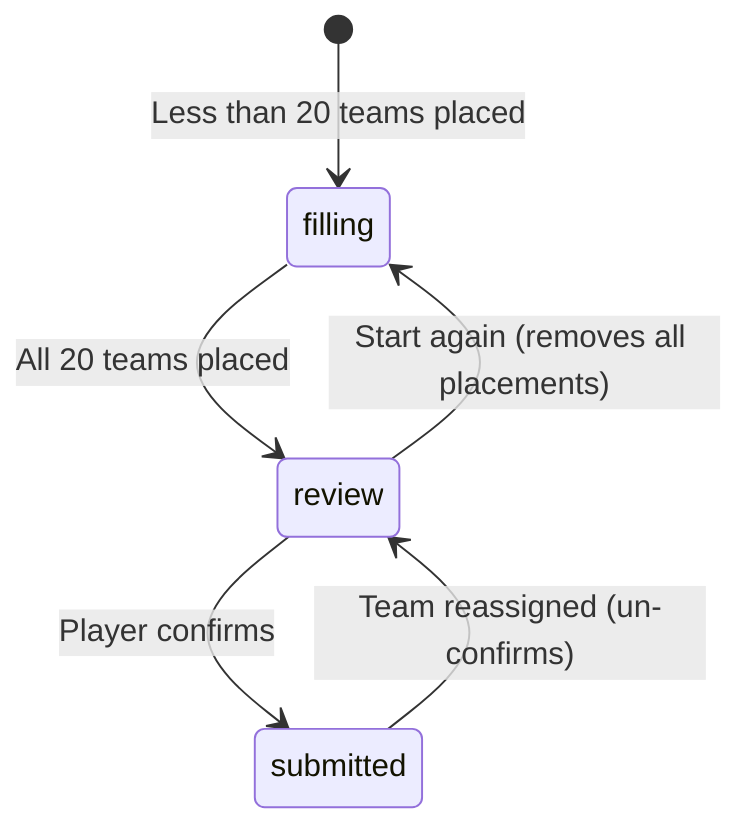

# Table Prediction Board Logic

The board logic in `src/lib/table-predictions/board.ts` implements the state transitions for the team-to-band assignment UI — keeping the decision logic pure and testable, separate from React rendering.

## Two-phase UX



### Filling phase (group-first)

Player selects an open Band, then taps teams into it — standard multi-select toggle semantics:

- **Tap unplaced team**: assigns to open Band
- **Tap already-placed team in the same Band**: reverts to previous Band (toggle-revert—the misclick escape)
- **Tap already-placed team in a different Band**: moves it to the open Band

Key function: `tapWhileFilling(state, teamId, openBand)` → `TapResult`

### Review phase (team-first)

All 20 teams are placed. Tapping a team "lifts" it from its current Band:

- **Drop into another Band**: `dropInto(state, teamId, band)` — moves the team; no toggle-revert
- **Swap two teams**: `swapBands(state, teamIdA, teamIdB)` — symmetrical exchange; calling swap again with the same teams restores the original arrangement (the undo mechanism)

Key functions: `dropInto()`, `swapBands()`

## Return type

All transition functions return a `TapResult`:

```typescript
interface TapResult {
  assignments: Assignments; // teamId → BandKey map
  previous: PriorBandByTeam; // teamId → prior Band (for undo)
  movedFrom: BandKey | null; // Band the team came from
}
```

## Undo model

The `previous` map stores each team's most recent prior Band, one level deep. The undo affordance replays a single move (back to `band`) or a swap pair (both teams back to their prior Bands).

## Fill-tone display

The `fillTone()` function classifies each Band's fill state for the count readout:

| Fill state | Condition           | Display           |
| ---------- | ------------------- | ----------------- |
| Under      | `filled < target`   | `"3/4 · 1 to go"` |
| OK         | `filled === target` | `"✓ 4/4"`         |
| Over       | `filled > target`   | `"5/4 · 1 over"`  |

## Roster ordering

Teams are shown in a fixed order based on last season's finishing position (promoted clubs last):

```
rosterOrder(teams) → sort by previousSeasonPosition, MAX_SAFE_INTEGER for promoted
```

Never re-sorted by placement — a club stays where the player learned it was.

## Phase transitions

`modeFor(placedCount, totalTeams)`:

- `placedCount < 20` → `"filling"`
- `placedCount === 20` → `"review"`

`startAgain()` returns to an empty board (the only operation that can't be reconstructed from cheap individual moves).

## Related

- [Capture Rules](capture-rules.md)
- [React Flow](react-flow.md)
- [ADR-0008: Predict the Table Group Fill Capture](../../docs/adr/0008-predict-the-table-group-fill-capture.md)
